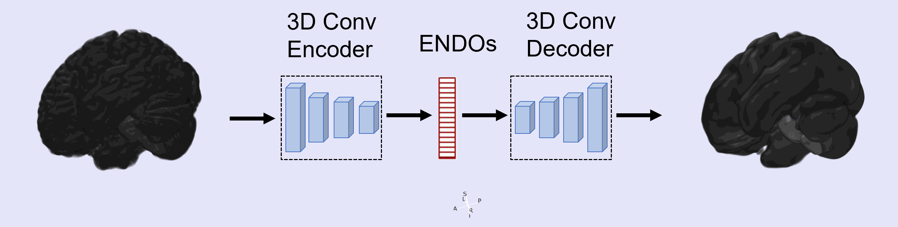
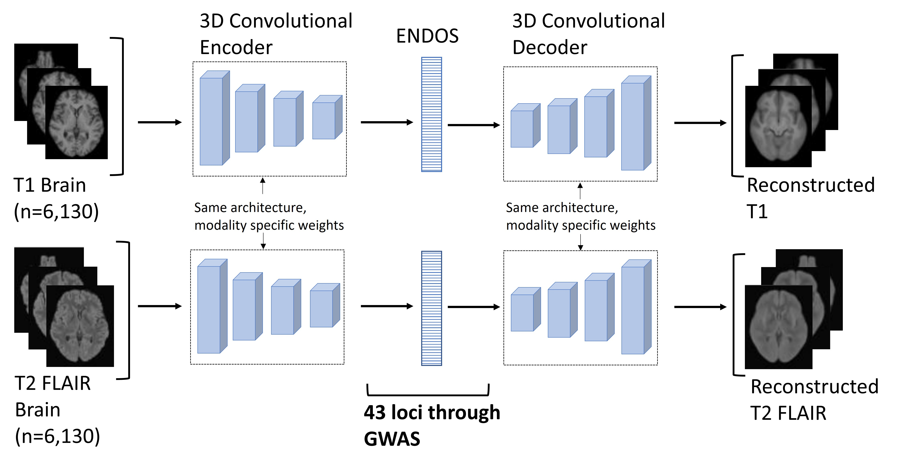
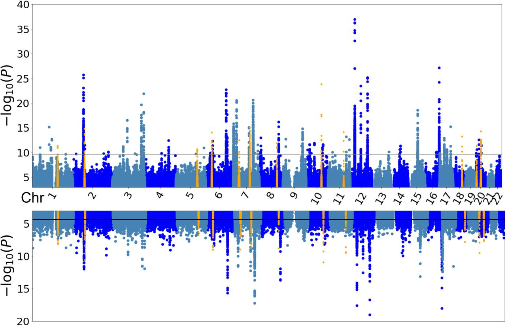
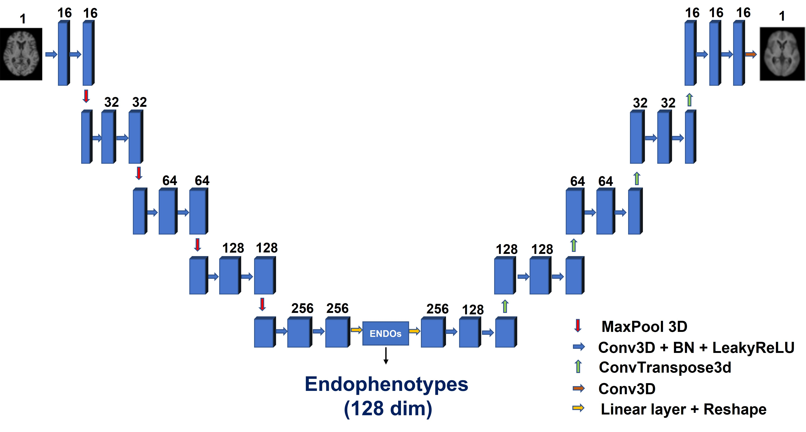
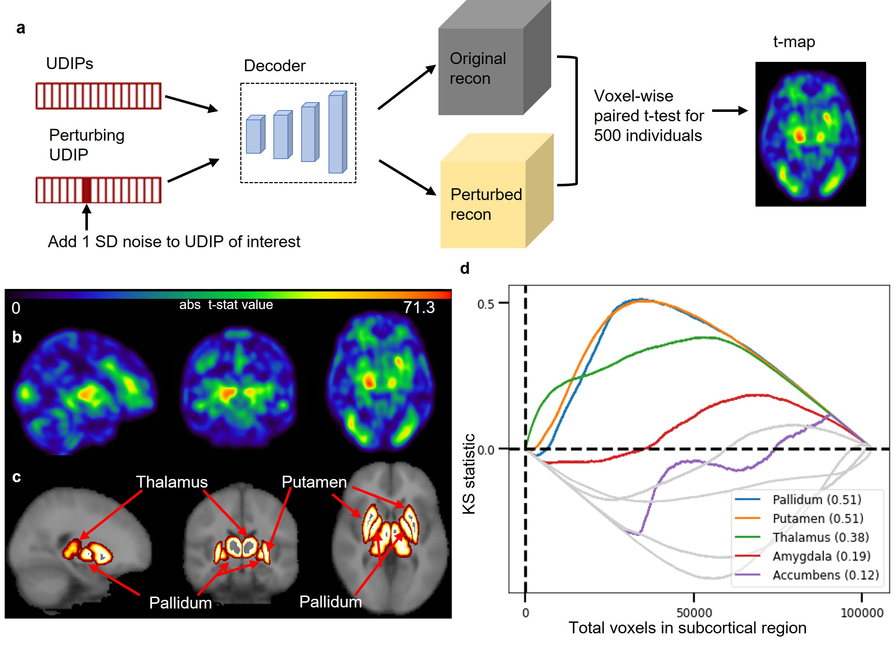

# Unsupervised Deep Representation Learning Enables Phenotype Discovery for Genetic Association Studies of Brain Imaging

This is the official repository accompanying the paper Unsupervised deep representation learning enables phenotype discovery for genetic association studies of brain imaging.

#### Authors: 

<h4> Khush Patel, Ziqian Xie, Hao Yuan, Sheikh Muhammad Saiful Islam, Yaochen Xie, Wei He, Wanheng Zhang, Assaf Gottlieb, Han Chen, Luca Giancardo, Alexander Knaack, Evan Fletcher, Myriam Fornage, Shuiwang Ji, Degui Zhi. </h4>

## Overview
We use unsupervised learning based on 3D convolutional autoencoder architecture to derive 128-dimensional imaging derived endophenotypes to represent complex genetic architecture of the human brain. The deep learning derived endophenotypes UDIPs (UDIP: Unsupervised Deep learning derived Imaging Phenotypes) identified 9,457 significant SNPs organized into 97 independent genetic loci of which 60 loci were replicated. Twenty-six loci were not reported in earlier T1 and T2 IDP-based UK Biobank GWAS. 

**Overall Pipeline**

## Aggregated Miami plot of all 256 single ENDO GWASs in discovery and replication cohorts

A seperate model is trained on T1 and T2. The model consists of an initial convolution block, four encoder blocks, a linear latent space of 128-dimension, four decoder blocks, and a final convolution block. Mean square error using a mask excluding background was used as loss. 

We also share our [model weights](https://drive.google.com/drive/folders/16IXv-w6xpHhEQiSNjRSI8S5wS4QDjGKE?usp=sharing). Please refer to [notebook](interpretation/ENDOs_T2_128.ipynb) in the interpretation file showing how to load the model weights.

## Model architecture

For mapping genes identified through GWAS to the specific regions of brain, we used perturbation based approach. We add noise to the dimension of the interest in the endophenotype and then identify the changes observed in the reconstruction. 

## Interpretation pipeline

Using the decoder neural network, we designed a perturbation-based decoder-interpretation (PerDI), which can tell what brain regions one ENDO dimension can map to. Without human labels, we rediscovered genes relevant to Thalamus, Pallidum, and Putamen.

## Code walkthrough

- [UDIP directory](UDIP) contains the files for generating UDIPs (also referred to as ENDOs). Read UDIPs/readme for clear instructions on how to run as command line tool.
- [training directory](training) contains the files for running the training and instructions for data preparation. 
- [interpretation directory](interpretation) contains the files for running the decoder generated perturbation based approach. 

## Dependencies 

- [PyTorch 1.10.0](http://pytorch.org)
- [Nibabel 3.2.1](https://nipy.org/nibabel/)
- [Monai 0.7.0](https://monai.io/)
- [PyTorch lightning 1.4.9](https://www.pytorchlightning.ai/)
- [pandas 1.3.4](https://pandas.pydata.org/)
- [torchmetrics 0.8.2](https://torchmetrics.readthedocs.io/en/stable/)
- [FSL 6.0.5 FLIRT](https://fsl.fmrib.ox.ac.uk/fsl/fslwiki/FLIRT/UserGuide)

## Data preprocessing
We did linear registration (12 DOF) to the preprocessed  brain extracted MRI provided by UKBiobank. 
https://git.fmrib.ox.ac.uk/falmagro/UK_biobank_pipeline_v_1/-/tree/master/

## Results
Checkout results at
http://deependo.org/

## Acknowledgements

This work was supported by grants from the National Institute of Aging (U01 AG070112-01A1). In addition, L.G. is supported in part by NIH grants UL1TR003167 and R01NS121154.

Images reproduced by kind permission of UK Biobank ©

## How to Cite:

Patel, K., Xie, Z., Yuan, H., Islam, S. M. S., Zhang, W., Gottlieb, A., Chen, H., Giancardo, L., Knaack, A., Fletcher, E., Fornage, M., Ji, S., & Zhi, D. (2022). New phenotype discovery method by unsupervised deep representation learning empowers genetic association studies of brain imaging. MedRxiv, 2022.12.10.22283302. https://doi.org/10.1101/2022.12.10.22283302

## Warning

* This repo is for research purpose. Using it at your own risk.
* GPL-v3 license.

