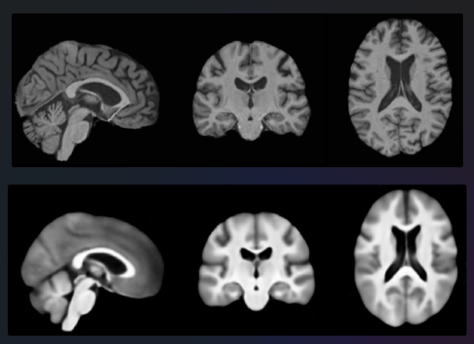
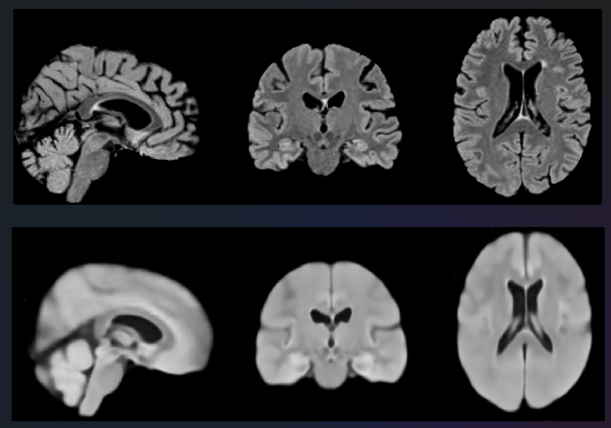

# Unsupervised representation learning of Brain MRI as phenotypes for genetic association studies
---
## This is the official repository accompanying the paper Xie et al. Unsupervised representation learning of Brain MRI as phenotypes for genetic association studies. 
---
### Overview
We use unsupervised learning based on 3D convolutional autoencoder architecture to derive 128-dimensional imaging derived endophenotypes to represent complex genetic architecture of the human brain. 

A seperate model is trained on T1 and T2. The model consists of an initial convolution block, four encoder blocks, a linear latent space of 128-dimension, four decoder blocks, and a final convolution block. Mean square error using a mask excluding background was used. 

### Code walkthrough

- [training directory](training) contains the files for running the training. 
- [interpretability directory](interpretability) contains the files for running the interpretability 

### Dependencies
- [PyTorch 1.10.0](http://pytorch.org)
- [Nibabel 3.2.1](https://nipy.org/nibabel/)
- [Monai 0.7.0](https://monai.io/)
- [PyTorch lightning 1.4.9](https://www.pytorchlightning.ai/)
- [pandas 1.3.4](https://pandas.pydata.org/)

### Reconstruction results

**Original T1 brain extracted MRI and reconstructed image from 128 dim latent space**

**Original T2 brain extracted MRI and reconstructed image from 128 dim latent space**

### How to Cite:

### Warning

* This repo is for research purpose. Using it at your own risk. 
* This repo is under GPL-v3 license. 
