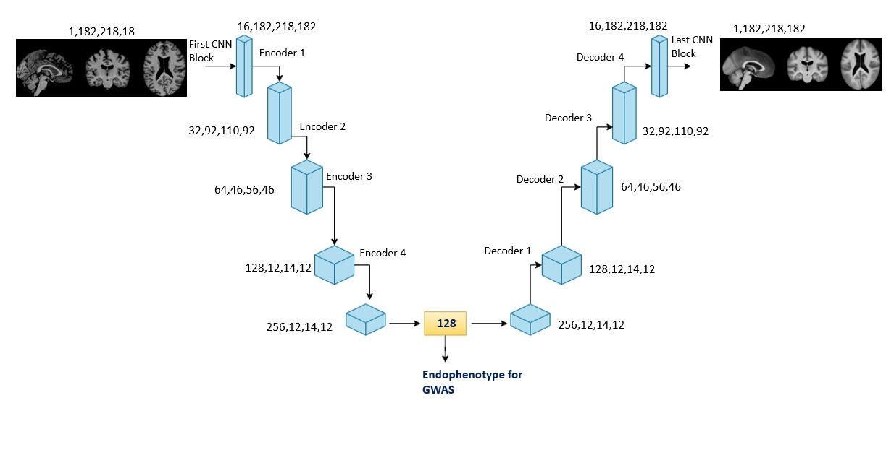

# Unsupervised representation learning of Brain MRI as phenotypes for genetic association studies
---
This is the official repository accompanying the paper Xie et al. Unsupervised representation learning of Brain MRI as phenotypes for genetic association studies. 
---
### Overview
We use unsupervised learning based on 3D convolutional autoencoder architecture to derive 128-dimensional imaging derived endophenotypes to represent complex genetic architecture of the human brain. 

A seperate model is trained on T1 and T2. The model consists of an initial convolution block, four encoder blocks, a linear latent space of 128-dimension, four decoder blocks, and a final convolution block. Mean square error using a mask excluding background was used. 

