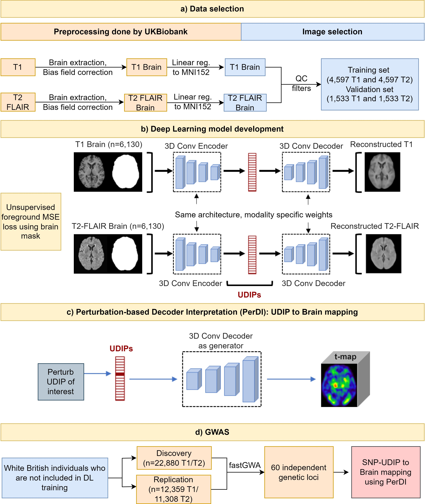
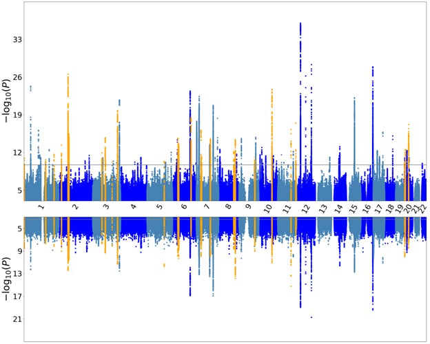
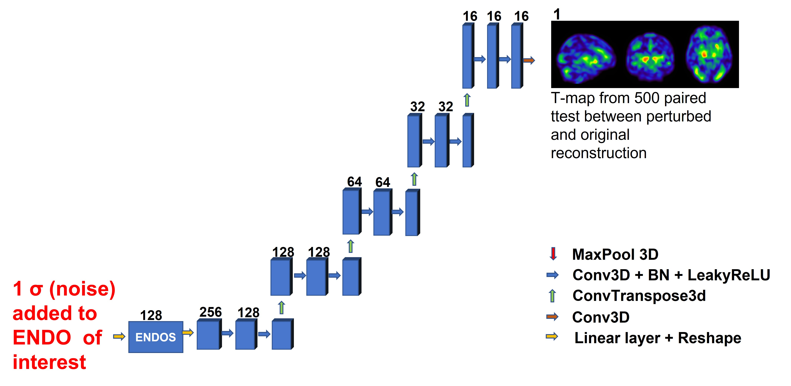
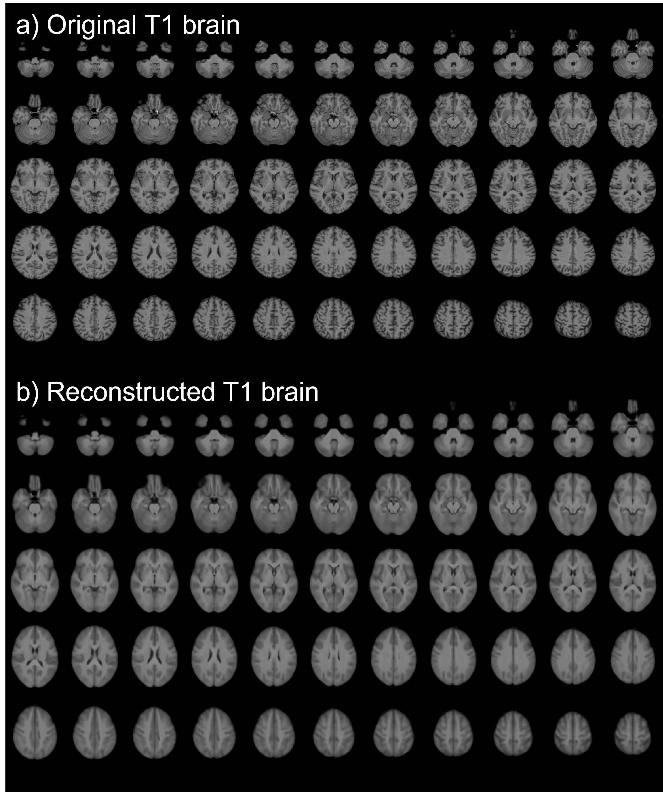

# New phenotype discovery method by unsupervised deep representation learning empowers genetic association studies of brain imaging.
---
This is the official repository accompanying the paper.

### Authors: 

<h4> Khush Patel, Ziqian Xie, Hao Yuan, Sheikh Muhammad Saiful Islam, Wanheng Zhang, Assaf Gottlieb, Han Chen, Luca Giancardo, Alexander Knaack, Evan Fletcher, Myriam Fornage, Shuiwang Ji, Degui Zhi </h4>

---

### Overview
We use unsupervised learning based on 3D convolutional autoencoder architecture to derive 128-dimensional imaging derived endophenotypes to represent complex genetic architecture of the human brain. The deep learning derived endophenotypes (ENDOs) identify 1,132 significant (P<5*10-8/256) SNP-ENDO pairs, out of which 658 are replicated (P<0.05/1132) in a seperate replication cohort.

**Overall Pipeline**

**Miami plot showing GWAS results in discovery and replication cohorts**

A seperate model is trained on T1 and T2. The model consists of an initial convolution block, four encoder blocks, a linear latent space of 128-dimension, four decoder blocks, and a final convolution block. Mean square error using a mask excluding background was used as loss. 

We also share our model weights at https://drive.google.com/drive/folders/16IXv-w6xpHhEQiSNjRSI8S5wS4QDjGKE?usp=sharing.  Please refer to prediction notebook in the interpretation file showing how to load the model weights.

**Model architecture**

For mapping genes identified through GWAS to the specific regions of brain, we used perturbation based approach. We add noise to the dimension of the interest in the endophenotype and then identify the changes observed in the reconstruction. 

**Interpretation pipeline**

### Code walkthrough

- [training directory](training) contains the files for running the training and instructions for data preparation. 
- [interpretation directory](interpretation) contains the files for running the decoder generated perturbation based approach. 

### Dependencies
- [PyTorch 1.10.0](http://pytorch.org)
- [Nibabel 3.2.1](https://nipy.org/nibabel/)
- [Monai 0.7.0](https://monai.io/)
- [PyTorch lightning 1.4.9](https://www.pytorchlightning.ai/)
- [pandas 1.3.4](https://pandas.pydata.org/)
- [FSL 6.0.5 FLIRT](https://fsl.fmrib.ox.ac.uk/fsl/fslwiki/FLIRT/UserGuide)

### Data preprocessing
We did linear registration (12 DOF) to the preprocessed  brain extracted MRI provided by UKBiobank. 
https://git.fmrib.ox.ac.uk/falmagro/UK_biobank_pipeline_v_1/-/tree/master/

### Reconstruction results

**Original T1 brain extracted MRI and reconstructed image from 128 dim latent space**

**Original T2 brain extracted MRI and reconstructed image from 128 dim latent space**

### How to Cite:

### Warning

* This repo is for research purpose. Using it at your own risk. 
* This repo is under GPL-v3 license. 
