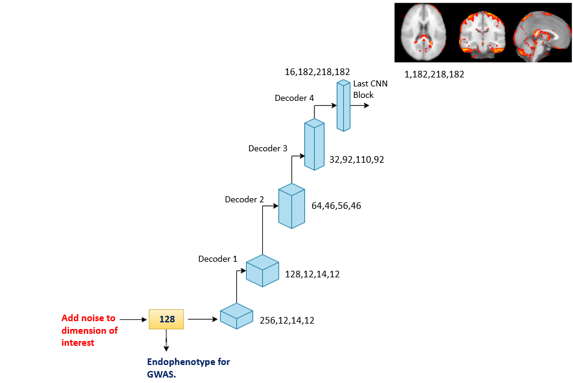

# Code files for generating interpretability for the endophenotype.

## The basic principle behind interpretability of a particular endophenotype is to perturb the particular endophenotype by adding noise and identifying corresponding changes over the MRI. 

### Code walkthrough

- model128.py: contains the autoencoder model used for the training.
- interpretability_T1.ipynb: contains the interpretability visualization for T1.
- interpretability_T2.ipynb: contains the interpretability visualization for T2.

### Requirements

- You will need to generate the latent space vector from the T1 and T2 MRI stored in your local directory. Here, we use csv file to load the 128-dim latent space vector. 
