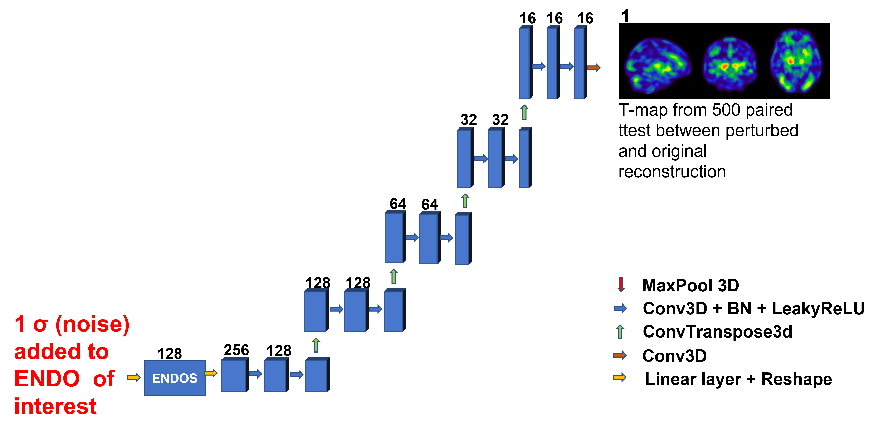

# Code files for generating interpretability for the endophenotype.

## The basic principle behind interpretability of a particular endophenotype is to perturb the particular endophenotype by adding noise and identifying corresponding changes over the MRI. 

### Code walkthrough
-perturbation based approach.ipynb: Perturbation based approach using decoder to map ENDOs to regions of brain.
-KS_statistic.ipynb: Generate KS statistic plots using Harvard Oxford cortical and subcortical atlas.
-model128.py: contains the autoencoder model used for the training.

### Requirements

- You will need to generate the 128 dim ENDOs from the T1 and T2 MRI stored in your local directory to use in jupyter notebook above. Sample code to do the same is provided.
