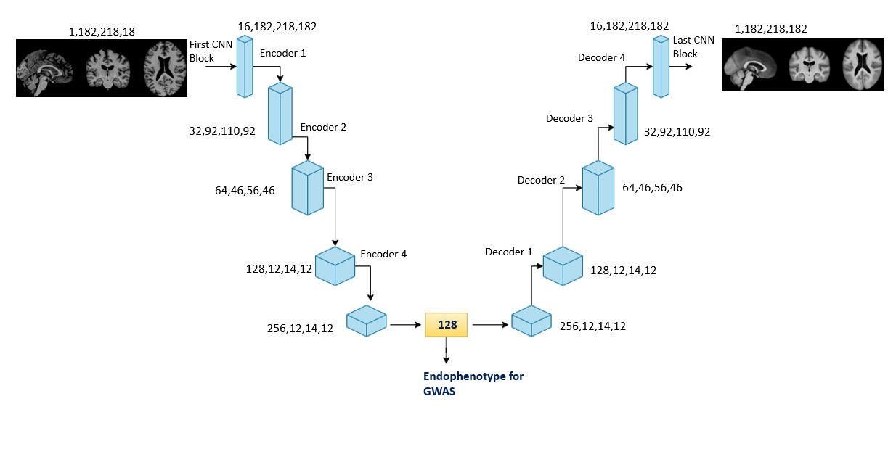

## Code walkthrough training files

- dataset.py: Defines custom pytorch dataset
- engine_128_T1.py: Code for training using T1 modality
- engine_128_T2.py: Code for training using T2 modality

Dataset file needs a csv mentioning the paths of T1 and T2 MRI images. CSV should contain EID, T1_unbiased_linear, T2_unbiased_linear fields where EID is the patient ID, T1_unbiased_linear contains file path for T1 unbiased linearly registered brain extracted images and T2_unbiased_linear contains file path for T2 unbiased linearly registered brain extracted images.
